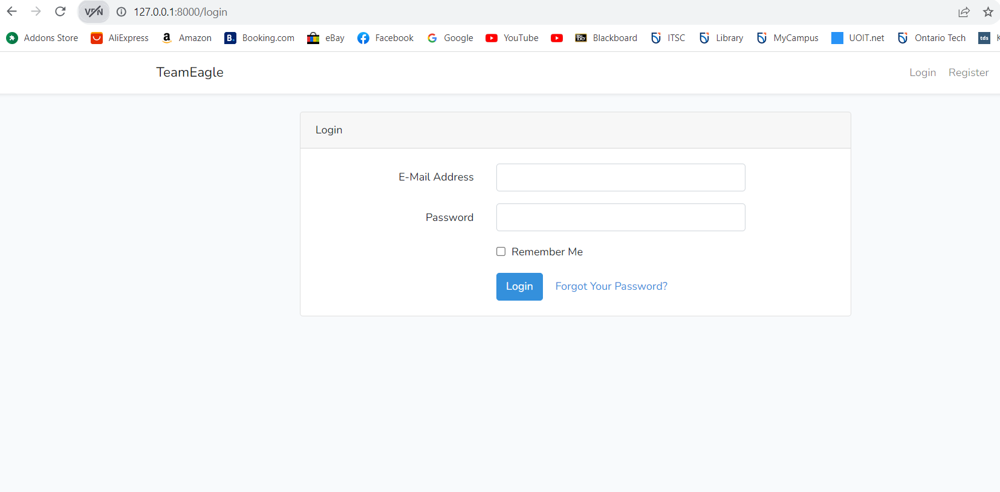
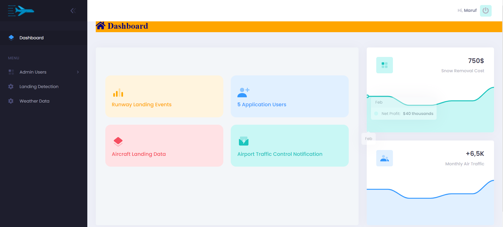
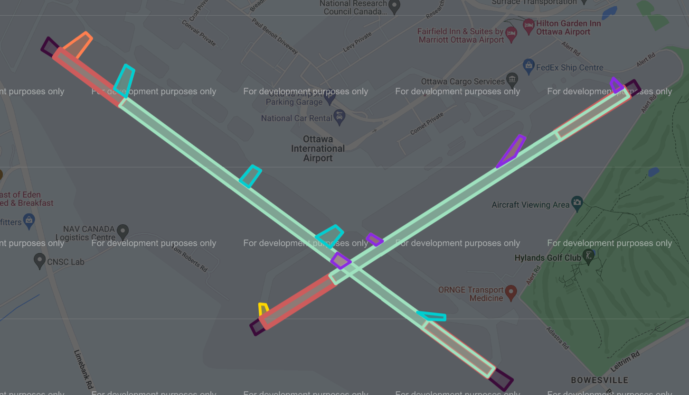
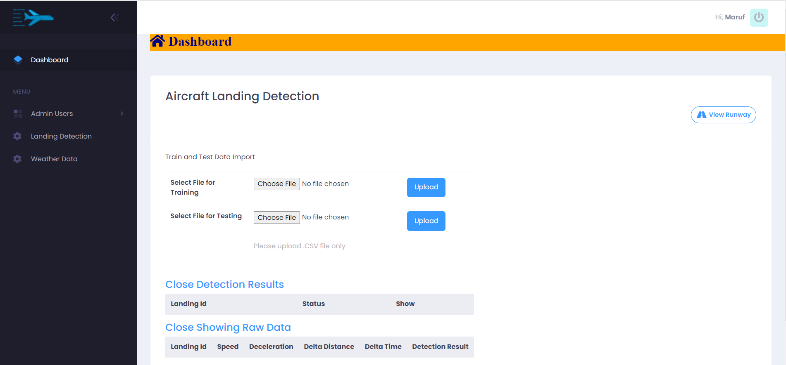

# Aircaft Landing Detection
This use a login template (Laravel 8 Boilerplate) is for educational only
## Features
- SPA CRUD (no reload-reload club with ajax)
- Serverside Datatable with Pdf/Excel
- Sweetalert2
- Metronic Template <a href="https://preview.keenthemes.com/metronic/demo1/index.html"> here </a>
- Many More

### Installation

#### -clone this repo and then open this project into your code editor (vs code recommended) 

```
git clone https://github.com/oryfikry/laravel-8-boilerplate.git
```
#### -rename .env.example to .env
#### -run composer
```
composer install
```
#### -run key generate
```
php artisan key:generate
```
#### -set your database in file .env and in your phpmysql or etc

#### -run migrate
```
php artisan migrate
```

#### -run 
```
php artisan serve
```
#### Optional
-for first register type manually "YOUR_URL/register"

you can setting login page default with:
go to vendor/laravel/ui/auth-backend/authenticatesuser
on showloginform() replace auth.login with v_login 

<!---

screenshoot
<br>
<br>
<br>
-->


# Aircraft Landing Detection Application

This repository contains the code and resources for the Aircraft Landing Detection Application. Below are previews of the application's interfaces and functionalities.

## User Authentication

Our secure login interface ensures that only authorized personnel have access.



## Main Application Interface

Experience our main interface where users can interact with a multitude of functionalities.



## Runway Overview

See an overview of the four runways and their respective statuses.



## Landing Detection

Gain insights into the landing detection mechanisms in action.




## Airline Trajectory Visualization

Get a visual insight into the trajectory followed by the airlines.


A more detailed trajectory view for another airline.


## Predicted Flight Paths

Witness the visual representation of predicted flight paths for enhanced air traffic management.


---

## Getting Started

To get the application up and running on your local machine, follow the instructions provided.

    - Xampp: MySQL database: Create Database Name, Create users table with necessary fields

    - Open the Project in PhpStorms IDE and run the command in the terminal: php artisan serve
    - PHP-7.4*
    - Laravel Framework 8.26.1


## Contributing

Rezwana Mamata and Md Al Maruf supervised by Dr Khalid Elgazzar and Sittichai


